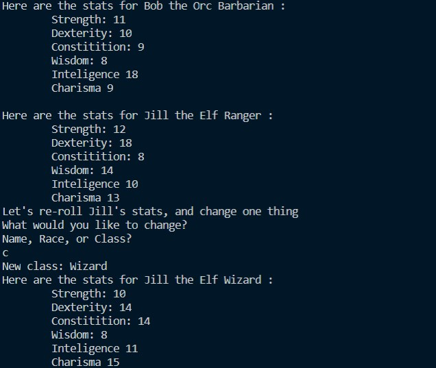
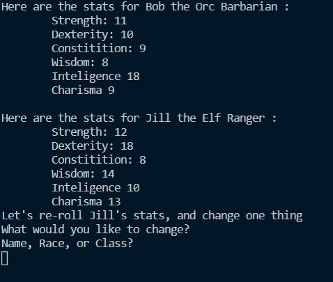
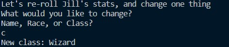

# This program uses Python 3.8.6

This is a prototype of an upcomming group project I will be working on and exceited to start!This provides a class to ramdomly generate the base stats of a character for the [_Dungeons and Dragons (5th edition)_](https://dnd.wizards.com/) roleplaying game from [_Wizards of the Coast_](https://company.wizards.com/). 

## Execution

To run the program `charactersheet5th.py`

You may open with [Python 3.8.6](https://www.python.org/) with your development envornment of choice. I shall use Visual Studio Code (VS Code) as that is what I'm familar with and prefer using.

1. Make sure that [Python 3.8.6](https://www.python.org/) is installed and set up with your development envornment. VS Code  will suggest a python extension if Python is already installed. 

2. Set up a virtual envornment via the teminal (VS Code). This can be done via the following command "py -m venv venv" wich will make a copy of the current version of Python being used for the hello world program.

3. Run the program. this can be done by pressing  F5 or Ctrl+F5 to run without debugging.

4. The program will open with this result.
    
   By this point it has created a character and generated base stats for it. These will be no lower than 
   6 and no higher than 18. Name and class are not generated nor do they affect the randomization (later version may change this).

   Then, it will give the user the opurtinity to change one thing for "Jill". It will randomize the stats and let the user change the name, race or class (these are strings). 

5. For this next step, the user may chose the change the name (by inputing Name, name, n or N), the class (by inputing Class, class,  c or C), or the race (Race, race, r, or R). For this example, I will change the class to Wizard. 
   

    

#### _Yay_! This is still a simple program, but still. 